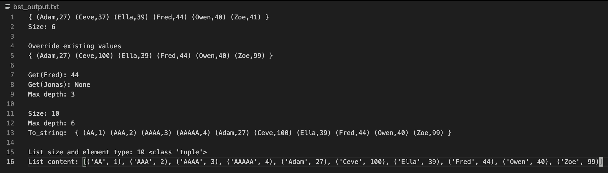

# Mini-project report 
Members: Eldaras Žutautas, Jianing Yang, Marek Ufnal and Zejian Wang
Program: Network Security  
Course: 1DV501
Date of submission: 2021-11-01

## Introduction

This project is a conclusion of the 1DV501 course. In this report will discus our implementation of two data structures, Hash Set and Binary Search Tree, as well as their usage. They will also be pitted against the Python's own built-in data structures: Set and Dictionary. We see this in Task 1 which asks us to handle a list of words using Python's data structures, which is then repeated in Task 3, but using our own.  Without further ado, lets dive into the tasks and see how they stack up:

## Part 1: Count unique words 1
In Task 1 we test the Python's own set and dictionary to provide us with a benchmark. First use the read_files (for both, Windows and MacOS) and get_words functions. They are recycled from assignment 3, where we compared and selected best functions from within the team. They are solely used to process the text files into a list of words.

 With that out of the way, everyone could open the files which we already had, the holy_grail.txt and news_100k.txt. 
 We used python's Set, which converts the word lists to word sets. By definition, the set removed duplicate entries. This means we could count the words by simply calling the len() function on the word sets. 
```Python
set_string = set(lst_string)
print(len(set_string))
```
This gave us the unique word count as follows:      
|      Text      | Unique words |
| :------------: | :----------: |
|   news_100K    |     87708    |
|   holy_grail   |      2121    |
 
 Next vital step was to use a dictionary. It can store our words key and value pairs. We first created an empty dictionary. Referring to our list of words form a text, we used a "for" loop to fill the dictionary with entries and their frequencies as long as their length was over 4. The code is as follows: 
```Python
txt_dict = {}
for word in lst_string:
    if len(word) > 4:
        if word not in txt_dict:
            txt_dict[word] = 0
        txt_dict[word] += 1
```

The last step was to sort the dictionary by value (frequency in our case):
```Python
frq_srtd_dict = sorted(txt_dict.items(), key=lambda tpl: tpl[1], reverse=True)
```
...and print the top 10 from the sorted dictionary using range(10):
```Python
for entry in range(10):
    print(frq_srtd_dict[entry])
```

These operations gave us this output:   
### Holy Grail
 

### News_100k


This will be important later, when we look at Task 3. 

## Part 2: Implementing data structures
In Task 2 we were asked to finish off the implementation of two data structures, a Hash Set and Binary Search Tree. Whilst the code skeleton was already implemented, we were tasked with writing various methods that enable us to use these structures.


The function takes hashset value and sets it to 0
Then it takes an element in a list and converts it to integer
and sums all the integer and then module it by the size of the buckets

```python
    def get_hash(self, word):
        hs_val = 0
        for e in word:
            hs_val += ord(e)
        return hs_val
```

We copy the list that was computed by get_hash function
self.buckets.clear() - clears the bucket making it empty
then we give a bucket a new size that is doubled by two
then in for loop we add the new lists into the bucket
and then we divide the size by the length of the buckets. 

```python
def rehash(self):
        buck_cp = self.buckets.copy()
        self.buckets.clear()
        self.buckets = [[] for i in range(self.size*2)]
        for lst in buck_cp:
            for name in lst:
                self.add(name)
        self.size = len(self.buckets)//2
```


The only one difference accrued and it is different placement of the names in the string. As given in the output - "Adam" is the first name in the list but in our occasion it is "Fred". But that is just different order which does not accrue randomly. And here is the output of HashSet_main:


### BstMap
A BstMap is a structure that contains key:value pairs in a network of nodes. Each node in this structure has four different elements. They are:

|   Element    | Role                                        |
| :----------: | :------------------------------------------ |
|     Key      | Key of the node, in our case a name.        |
|    Value     | Value of the node, in our case an age.      |
|    Left      | The node to the "left" of our current node. |
|    Right     | The node to the "Right" of our current node.|

For the purposes of this task, it made sense to arrange input in alphabetical order as it was a list of names paired with the age for each person. This meant that we were going to use names as our key and age as a value. Furthermore, the first entry in our sample list was "Ella". This is significant because the letter "E" is fairly in the middle of the alphabet. Therefore we should have entries on either side of the tree.

It is worth mentioning that we could have chosen to use the age as a key, but it made less sense to do so.

This leads us to the point where our code had to reflect out decision to add pairs, based on the alphabetical order of the names (keys). This approach was employed to add new entries:

``` Python
 def put(self, key, value):
        if self.key == key:
            self.value = value
        elif key > self.key:
            if self.right is None:
                self.right = Node(key, value, None, None)
            else:
                self.right.put(key, value)
        elif key < self.key:
            if self.left is None:
                self.left = Node(key, value, None, None)
            else:
                self = self.left.put(key, value)
```
From the code it can be deduced that we first check if the entry exists at current root node and if it does, we update it's value. This is followed by a comparison, where if the new unique entry has a higher key (higher letter in the alphabet), it goes "right", otherwise (lower) it goes "left". The process is repeated recursively until we find an empty node where we can store this new pair.

Once the BstMap is populated with nodes, we can then proceed to check it's max depth. This is what it looks like programmatically:

```Python
    def max_depth(self):
        depth = 0
        l_depth = 0
        r_depth = 0

        # Check depth for left and right
        if self.left is not None:
            l_depth += self.left.max_depth()
        if self.right is not None:
            r_depth += self.right.max_depth()

        # See which is deeper
        if r_depth > l_depth:
            depth = r_depth
        else:
            depth = l_depth
        depth += 1

        return depth
```

As can be seen above, we obtain the max depth by comparing left portion of the tree to the right portion. The comparison is done recursively so that each node is "asked" to run this comparison until there is no more nodes to "ask". In this instance a node returns the sum of the depth of its deepest branch (either left or right) plus one for its own depth. 

Few things to notice is that if left and right depths are equal, we return left depth. This doesn't matter as the result would be the same using the right branch since the depths are equal. In turn, it allows us to skip an extra step, therefore making our code more attractive. 

Last but not least. we were able to replicate the results obtained in the bst_main.py for all functions. We believe the key (pun intended) to this was the way we categorised our entries using the alphabetical order applied to keys upon their addition. Here is the bst_output.txt:



...and here is the output from bst_main.py:


## Part 3: Count unique words 2

Firstly, we import the functions of read_file and get_words_ZW that are also used in Task 1. They are used to extract the words from a file and make a list containing all the words in this file. Then we define a function that build a bstmap from the list by the dataclass Bstmap we have created in Task2. As previously explained, the node in bstmap has 4 fields, but more specifically for the large texts they are: 
key = word, 
value = frequency of this word in a text, 
left = node containing words of lower alphabetical value
right = node containing words of higher alphabetical value. 

For each word in the list, we get the value(frequency) of it using the bstmap get method. If the value(frequency) of it is 'None', then we use the bstmap's 'put' method to add the word and the value(frequency 1) in the bstmap. If the word already exists in the bstmap, the value(frequency) of it is incremented by 1. All the different word in the list will be added in the bstmap and their frequencies will be reflected by its value. The code fragment is the following:
```Python
def build_bst(lst):
    Bst = bst.BstMap()
    for word in lst:
        if Bst.get(word) is None:
            Bst.put(word, 1)
        else:
            value = Bst.get(word) + 1  
            Bst.put(word, value)
    return Bst
```
The bstmap is done. we use the bstmap "as_list" method created in Task 2 to form a list containing all the words and their values(frequencies) in the bstmap, then we use the sorted method to sort the list, the most frequently used word and its value(frequency) will be in the first in the list. Then we use "len" method to extract the length of word larger than 4, a variable named counter is for counting the first 10 words(length are larger than 4) and their values in the list. This is achieved by a custom "top_10" function:

```Python
def top_10(bst_tree):
    top_10_sort = []
    top_10_sort = sorted(bst_tree.as_list(), key=lambda x: x[1], reverse=True)

    counter = 0
    for entry in top_10_sort:
        if len(entry[0]) > 4:
            print("(" + entry[0], end=', ')
            print(str(entry[1]) + ")")
            counter += 1
        if counter == 10:
            break
```
This function only "prints" the top 10 entries at the moment, but could be easily adapted to store and return a list of top 10 entries instead. This list could then be printed from main instead, but since we are only asked to demonstrate the top 10, printing seemed like an adequate method for our purposes.

Thanks to characteristics of our custom datatypes we get these results:


Number of unique words for news_100k: 
87708
Number of unique words for Holy_grail: 
2121

Please note that the above is congruent with the output from Task1 and yields the same results!


|      Text      | Max bucket size | Max BST depth |
| :------------: | :-------------: | :-----------: |
|   news_100K    |       309       |       43      |
|   holy_grail   |        16       |       27      |


## Part 4: Plotting

In this task we were asked to produce a couple of graphs using matplotlib to analyse our data. 

First graph presents the frequency of words of a given length. We used the BstMap structure for this as we could conveniently modify the building process to change the key from the actual word to a length of a this word:
```Python
def build_bst_modified(lst):
    Bst = bst.BstMap()
    for word in lst:
        temp = len(word)  # <- This is what modifies the key.
        if Bst.get(temp) is None:
            Bst.put(temp, 1)
        else:
            value = Bst.get(temp) + 1
            Bst.put(temp, value)
    return Bst
```
Naturally this means our tree is quite small and shallow, but it does hold values (frequency) for all words in a text. This means we can now plot our bst keys vs bst values to check word length against how often they appear in a text. The result is the first  graph:


It is important to understand that there are words over 16 letters long, but they were ignored as they are more likely to be problems with our function get_words, as opposed to actual English words. Moreover their frequency in the text was so low, they can be safely cast aside as outliers. 

The above figure features two graphs, which brings us to the second part of the task. We are tracking the unique words in a set (Hash Set) vs added words from a list. We are presented with an exponential graph. So what is the significance? We believe this is a suggestion as to the efficiency of a hash set vs other structures. Moreover, the more we add the higher the likelihood the entry is already contained in the set, so this data type is suited for processing large data samples. It has to be said that the efficiency of the Hash Set is greatly dependent on the Hashing method and consequently the look-up[1]. This is beyond the scope of what we will discuss here. 

## Project conclusions and lessons learned
### Technical issues

    Git
Git repository wasn't ready when we started the project which meant that every member of the team had to work without access to the repository. This had lead to a little problem with individual pushing. At first only one person pushed everything since we thought it does not matter. We fixed the situation quite fast, although a substantial portion of initial work, done by all team members, was submitted in an initial push by Marek. 

Moreover, everyone in the team didn't have much experience using git (baring the usage of git in Assignment 3) so we ended up pushing to main branch. This was less than ideal as we had to be very rigorous with who can update files. Later in the task, we experimented with branches a little, but it was too little too late. In hindsight, it would have been far more optimal to work with multiple branches that we could merge into main. This is a lesson we will carry moving forward.

    OS
Whilst a small issue, we had to make sure file reading worked for team members using MacOS, as well as Windows. The fix was straight forward, nonetheless it was an interesting obstacle in the project.

    Directory management
This wasn't a major part of the project but we strived to make a the file system efficient so all programs can import functions a function module instead of storing copies of function for each task. [2]

    Hashing
This is a highly debatable topic in IT. There are many attempts at creating a perfect hashing function which results in 1-1 ratio of buckets to entries[1]. We were able to implement a reasonably basic and straight forward hashing mechanism that was perfectly adequate for the task. If we had more time, we would love to attempt to construct a more advanced hashing function.

### Project issues
We organised the work by dividing work load between smaller teams of two. This was done to make sure we do not double our workload and repeat doing same tasks twice. To make sure all members of the team were up-to-date with what everyone was doing, we held in-person meetings, roughly every other day. During these meetings, both sub-teams were presenting their work to each other to make sure all members understood what each function, method or section of code was doing.

In addition we have established communication early using Whatsapp messenger as well as a Discord channel. This helped us with organising meetings, as well as sharing ideas. There was an ongoing discussion taking place daily.

We assigned certain responsibilities to the following members:
    Task 1
Due to early teething issues with communication and git repo, Task 1 was attempted by everyone. Jianing was the first to show a complete solution so we ended up using his version, but it is worth noting, functions used in this tasks were picked from assignment 3. A good example is the get_words function that was built from Zejian's assignment 3 function.

    Task 2 
Here we split the responsibilities between two sub-teams. The fundamentals of Hash Set were implemented by Eldaras, helped by Zejian. They were in charge of writing the hashing and adding method. Later they divided the to implement the rest of the methods between them.

On the other side, Marek and Jianing were working on the BST. They were able to decide on a method of building the tree, and once that was done, the rest of the methods followed the same basic principle of looking left or right. Between Marek and Jianing, the rest of the methods were implemented. 

Once both teams had complete structures, we organised presentations for each other to explain how every method works. Please keep in mind, all along, we had access to other teams code and had discussions regarding other team's methods. During the presentations, we were not only able to show code, but draw and explain the structures to help each other understand, as it was paramount that all members are familiar with all code. 

    Task 3
Here Marek and Zejian were the biggest contributors modifying existing code to suit the demands of task 3. We already had most structures, but needed to use them to process the text files. Once the basic version of the code was established, all members contributed to clean up and improve code.

    Task 4
In this task we noticed a lot of Task 3 code could be recycled. Once that was done, Marek was able to modify the "build" functions and plot graphs.

    Lessons learned

This project was a great imitation of a real workplace, preparing us for a professional environment. We learned about the importance of communication within the team. This was crucial to complete the tasks on time. Moreover, this was also a good opportunity to work on both, spoken and written English suitable for academia.

An important aspect of this project was learning data structures that are widely used and very relevant in modern day computing. Enhanced versions of these structures can be found for example in search engines. 

If we had a chance to do this project again, we would definitely aim to improve the way we were working with git. This proved to be our weak point that needs to be worked on. Managing individual branches, as well as merging them to main, would be far more practical and efficient than our approach. 

In addition, we would love to improve several functions (top_10 being the prime example) to perhaps be a little more robust and advanced, but given the time constraints, we settled for the current version. 

[1] ( "Hash, displace, and compress", Belazzougui, Djamal; Botelho, Fabiano C.; Dietzfelbinger, Martin (2009))
[2] ("Python 3.10.0 Documentation", https://docs.python.org/3/tutorial/modules.html)
